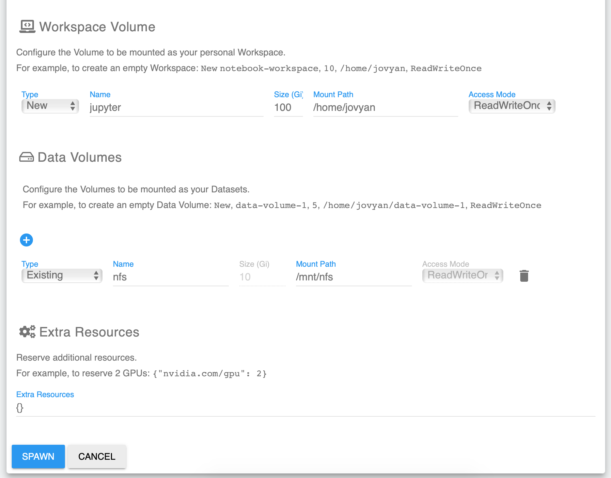
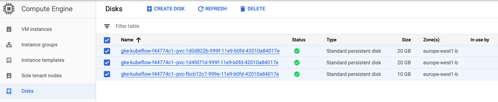

# Setup a Kubeflow Cluster on GKE

This procedure describes the manual steps to setup a Kubeflow Cluster on Google Kubernetes Engine (GKE).

It is mainly based on the Google Cloud Deployment tool which setup a (up-to-date) "reference/minimal" Kubeflow cluster on GKE. Additional setup steps are performed to enable IAP authentication to the cluster, add extra GPU nodes, and add some extra storage.

At the time of writing, this procedure will install a Kubeflow 0.5 cluster on GKE

See Kubeflow's documentation for more details on [installing Kubeflow on GKE](https://www.kubeflow.org/docs/gke/)


## Step by Step instructions

I encourage you to read this whole document before starting to build your cluster. Especially, I  summarize the steps to be performed, usually followed by some screenshot examples that illustrate the process. Also when relevent, I also include pointers to the official GCP documentation.


### Get a Google Account if needed

Sign-in or Create a new [Google Account](https://accounts.google.com/)


### Create a new billing account if necessary

1. Go to the [Google Cloud Platform Console](https://console.cloud.google.com) and sign in or, if you don't already have an account, sign up.
2. Open the console left side menu and select Billing.
3. Click the New billing account button. (Note that if this is not your first billing account, first you need to open the billing account list by clicking the name of your existing billing account near the top of the page, and then clicking Manage billing accounts.)
4. Enter the name of the billing account and enter your billing information. The options you see depend on the country of your billing address. 
5. Click Submit and enable billing.

See more details in [GCP documentation](https://cloud.google.com/billing/docs/how-to/manage-billing-account)

**Note** : If you are a new GCP user, you can have **300$ of free credits to discover GCP**. Have a look at [GCP Free credits](https://cloud.google.com/free/). Also note, that in order to have access to GPU ressources, you will need to have enable billing on your account (in other words, you need to setup your payment card info)


### Create a GCP project

1. [Open this link to create a new GCP project]( https://console.cloud.google.com/projectcreate)
   - Choose a **Project Name**
   - Edit the **Project ID** if you want (This project ID will be reused a lot later and will be used in some URL to be created)
   
   <br>GCP new project popup:<br>
   <br>
   <br>GCP project home:<br>
   <br>
      
   Note: 
   - Keep track of the **Project Name** and **Project ID** as you will need them in the next steps.
   - If you have multiple GCP projects, switch to the Kubeflow project.
   
   <br>GCP dashboard:<br>
   
   <br>Eventually, switch of GCP project using the project list in the menu bar:<br>
      
   <br>Switch of GCP project:<br>
   

        
2. If needed [change/modify the Project Billing as described in the GCP documentation ](https://cloud.google.com/billing/docs/how-to/modify-project)

   Modify the project Billing using the GCP Navigation menu:<br>
   


### Setting up OAuth credentials 

Follow these [instructions from the Kubeflow documentation](https://www.kubeflow.org/docs/gke/deploy/oauth-setup/) to setup OAuth for Cloud IAP (In case of issues with the IAP setup, have a look at this documentation for [troubleshooting IAP](https://www.kubeflow.org/docs/gke/deploy/monitor-iap-setup/))

1. Set up your [OAuth consent screen](https://console.cloud.google.com/apis/credentials/consent)
   - In the Application name box, enter the name of your application. The example below uses the name “Kubeflow”.
   
   - Under Support email, select the email address that you want to display as a public contact. You must use either your email address or a Google Group that you own.

   - In **Authorized domains**, enter
        ```
        <project_id>.cloud.goog
        ```
        * where `<project_id>` is your Google Cloud Platform (GCP) **project ID**
           
   - Click **Save**
   
   <br>Example of the OAuth consent form filled
   <br>
    

2. Create an OAuthClientID
   <br>On the [credentials tab](https://console.cloud.google.com/apis/credentials):

   - Click Create credentials, and then click OAuth client ID.
   - Under Application type, select Web application.
   - In the Name box enter any name for your OAuth client ID. This is not the name of your application nor the name of your Kubeflow deployment. It’s just a way to help you identify the OAuth client ID.
   - **For the moment, let the the Authorized redirect URIs box empty**
   - Click on the "Create" button
   
   <br>Example illustrating the procedure : Click on the "Create credentials" button and choose "create an OAuth Client ID":<br>
    
   
   <br>Example of the filled form to create an "OAuth Client ID":<br>
    
   

   - **Make note of the client ID and client secret** that appear in the OAuth client window. You need them later to enable Cloud IAP.

   <br>Example of the OAuth Client ID and secret displayed in a popup after their creation:<br>

    
   
   <br>Example of the OAuth Client ID dashboard:<br>
   
     


3. Edit the OAuthClientID just created to add an Authorized redirect URIs

   - In the Authorized redirect URIs box, enter the following 
        ```
        https://iap.googleapis.com/v1/oauth/clientIds/<CLIENT_ID>:handleRedirect
        ```
       * `<CLIENT_ID>` is the OAuth client ID that has been previously created`

   - Press Enter/Return to add the URI. Check that the URI now appears as a confirmed item under Authorized redirect URIs. (The URI should no longer be editable.)

   - Click on the "Save" button 
   
   <br>Example of the filled form to update the OAuth Client ID":<br>
    


   
   
### Create a Kubeflow Cluster    

We will use the [GCP deploy](https://deploy.kubeflow.cloud/) tool to deploy a Kubeflow cluster on GCP

The default template will create 2 "n1-standard-8" Compute Engine nodes for a total of 16 cores and 60GB of RAM (By default autoscaling is enabled with a max nodes limit of 10)

To deploy Kubeflow on Google Cloud Platform:
- Open the [GCP deploy](https://deploy.kubeflow.cloud/) tool, and eventually, sign in with your Google Account
- Enter the **Project ID** of the GCP project that have been previously created
- Pick a name for your **deployment** (Keep track of the name, as you will need it to forge the URL to access your Kubeflow cluster)
- ~~Choose "Login with GCP IAP" as method to connect to kubeflow service~~
  - **IAP Issue with Kubeflow 0.5** : It seems that there are some issues with Kubeflow 0.5 when using IAP. In particular I have noticed some difficulty to access Jupyter Notebooks or spawning a Jupyter server that mounts a NFS volume. Until the issue is solved, here is a bypass solution :
     - Select "Setup Endpoint Later" instead of "Login with GCP IAP"
     - Later, you will access the cluster through [port forwarding](#Accessing-the-Kubeflow-cluster-through-Port-Forwarding).
     
- (Optional) Choose GKE zone where you want Kubeflow to be deployed
- (Optional) Choose Kubeflow version
- Click Create Deployment

<br>Example of the Create a Kubeflow deployment form:<br>


- Wait for the cluster being ready 

**Note:** The Envoy Ingress service may take a few minutes to become available.

<br>Example of logs during the cluster creation (This may take a while to proceed as the deployment must grant access to a several servives before spawning up GCP Compute Instances for the GKE installation:<br>


- After a while you can check the Compute Instances in the GCP console:

   ```
   https://console.cloud.google.com/compute/instances?project=<project_id>&instancessize=50
   ```
   * where `<project_id>` is your Google Cloud Platform (GCP) **project ID**

   <br>Example of the Compute Instance dashboard:<br>

    

- Then a few time after you can check the Kubeflow deployment on GKE in the GCP console;

   ```
   https://console.cloud.google.com/kubernetes/discovery?project=<project_id>&service_list_tablesize=50
   ```
   * where `<project_id>` is your Google Cloud Platform (GCP) **project ID**

   <br>Example of the GKE services dashboard:<br>

   

- Once all the Kubeflow services will be deployed in GKE, Kubeflow will be available at the following URL (Remember, that the Envoy Ingress service may take quite a moment to become available. In case of difficulty to access Kubeflow in your browser, have a look at this documentation for [troubleshooting IAP](https://www.kubeflow.org/docs/gke/deploy/monitor-iap-setup/)):

   ```
   https://<deployment_name>.endpoints.<project_id>.cloud.goog/
   ```
   * where `<project_id>` is your Google Cloud Platform (GCP) **project ID**
   * where `<deployment_name>` is the deployment name you have chosen when deploying **project ID**

   <br>Here is Kubeflow 0.5 dashboard:<br>

   


### Additional Setup for REMOTE Kubeflow pipeline execution 

IMPORTANT : This method require an **IAP-enabled cluster** 

You will need to setup a GCP service account with the necessary permissons, and added as an 'IAP-secured Web App User'

Some instructions on how to setup this area available [here](https://github.com/amygdala/examples/blob/cookbook/cookbook/pipelines/notebooks/kfp_remote_deploy.ipynb)

In summary, you have to define in your GCP/GKE environment, a Google json key file for the service account deployment on the GKE Kubeflow cluster. To run the notebook locally, you have to set the GOOGLE_APPLICATION_CREDENTIALS environment var to point to your service account credentials:

`export GOOGLE_APPLICATION_CREDENTIALS=<your_json_key_file_path> `

(Note : you should do this before launching your Jupyter Notebook server)


### Add a Google Storage bucket

- Navigate to the Google Storage Dashboard

   ```
   https://console.cloud.google.com/storage/browser?project=<project_id>
   
   ```
   * where `<project_id>` is your Google Cloud Platform (GCP) **project ID**

   <br>Example of the GS dashboard:<br>

   

- Create a Bucket: Choose a Bucket name. The Name of the bucket must be unique (as a consequence you will have to adjust the GS URL to be used in the Pix2Pix Jupyter Notebooks)

   <br>Example of Bucket creation (Bucket Name)<br>

   


- Create a Bucket: Select the *Regional* storage class and specify the same location as your Kubeflow cluster. 

   <br>Example of Bucket creation (Storage Class)<br>

   
   
- Create a Bucket: In the Advanced settings, choose Google managed-keys for the encryption

   <br>Example of Bucket creation (Advanced Settings)<br>

      

- Create a Bucket: Click the Create button

   <br>Example of the created Bucket details<br>

    
   
- Click on the bucket details overview tab. **Keep track of the gsutil link** (you will have to use this link in the Jupyter Notebooks to access your GS bucket)

   ```
   gs://<bucket_name>
   ```
   * where `<bucket_name>` is the unique name of your bucket

   <br>Example of Bucket details overview<br>

     
   
   

### Add NFS storage in the Kubeflow cluster

(In this example, a NFS storage of 200GB will be created. Adjust this value if you want)

- Open a Cloud shell Terminal

- Configure the Cloud shell environment

   ```
   export PROJECT=<project_id>
   export NAMESPACE=<deployment_name> 
   export ZONE=<zone>
   
   gcloud config set project ${PROJECT}
   gcloud container clusters get-credentials ${NAMESPACE}  --zone ${ZONE}
   mkdir -p ~/kubeflow-script
   cd ~/kubeflow-script
   
   ```

   * where `<project_id>` is your Google Cloud Platform (GCP) **project ID**
   * where `<deployment_name>` is the deployment name you have chosen when deploying Kubeflow  
   * where `<zone>` is your Google Cloud Platform (GCP) zone to use


- Execute the following scripts


   1. Setup persistentvolumeclaim/nfs-pv 
   
   ```
   cat > ./gce_pd.yaml <<- "EOF"
   apiVersion: v1
   kind: PersistentVolumeClaim
   metadata:
     name: nfs-pv
   spec:
     accessModes: [ "ReadWriteOnce" ]
     resources:
       requests:
         storage: 200Gi
   EOF
   
   kubectl create -f gce_pd.yaml --namespace ${NAMESPACE}   
   ```
   
   <br>
   2. Setup replicationcontroller/nfs-server 
   
   ```
   cat > ./nfs-server-rc.yaml <<- "EOF"
   apiVersion: v1
   kind: ReplicationController
   metadata:
     name: nfs-server
   spec:
     replicas: 1
     selector:
       role: nfs-server
     template:
       metadata:
         labels:
           role: nfs-server
       spec:
         containers:
         - name: nfs-server
           image: k8s.gcr.io/volume-nfs:0.8
           ports:
             - name: nfs
               containerPort: 2049
             - name: mountd
               containerPort: 20048
             - name: rpcbind
               containerPort: 111
           securityContext:
             privileged: true
           volumeMounts:
             - mountPath: /exports
               name: mypvc
         volumes:
           - name: mypvc
             persistentVolumeClaim:
               claimName: nfs-pv
   EOF
   
   kubectl create -f nfs-server-rc.yaml --namespace ${NAMESPACE}   
   ```

   <br>
   3. Setup service/nfs-server

   ```
   cat > ./nfs-server-service.yaml <<- "EOF"
   kind: Service
   apiVersion: v1
   metadata:
     name: nfs-server
   spec:
     ports:
       - name: nfs
         port: 2049
       - name: mountd
         port: 20048
       - name: rpcbind
         port: 111
     selector:
       role: nfs-server
   EOF

   kubectl create -f nfs-server-service.yaml --namespace ${NAMESPACE}
   ```

   <br>
   4. Setup persistentvolume/nfs 
   

   ```
   cat > ./nfs-pv.yaml <<- "EOF"
   apiVersion: v1
   kind: PersistentVolume
   metadata:
     name: nfs
   spec:
     capacity:
       storage: 200Gi
     accessModes:
       - ReadWriteMany
     nfs:
       # replace the following ip with your NFS IP
       server:  REPLACE_IP
       path: "/"
   EOF

   export NFS_IP=$(kubectl get svc nfs-server -n kubeflow -o jsonpath='{.spec.clusterIP}')
   sed -i "s/REPLACE_IP/$NFS_IP/g" "./nfs-pv.yaml"

   kubectl create -f nfs-pv.yaml --namespace ${NAMESPACE}
   ```

   <br>
   5. Setup persistentvolumeclaim/nfs

   ```
   cat > ./nfs-pvc.yaml <<- "EOF"
   apiVersion: v1
   kind: PersistentVolumeClaim
   metadata:
     name: nfs
   spec:
     accessModes:
       - ReadWriteMany
     storageClassName: ""
     resources:
       requests:
         storage: 200Gi
   EOF

   kubectl create -f nfs-pvc.yaml --namespace ${NAMESPACE}
   ```

- Make sure the Kubeflow Jupyter notebooks are able to write to this volume

   1. Open a shell on the NFS server pod

   ```  
   NFSPOD=`kubectl -n kubeflow get pods --selector=role=nfs-server| tail -1 | awk '{print $1}'`
   kubectl -n kubeflow exec -it $NFSPOD bash
   ```

   2. Creates a data directory that will be read-writable by the Jupyter notebooks when mounted.

   ```
   cd exports/
   mkdir data
   chown -R 1000:100 data
   exit
   ```


### Add a GPU nodes pool to the cluster

A node pool can be added to the Kubeflow GKE cluster via the GCP UI, but as we also need to install the Nvidia driver on these nodes, the whole process will be executed using the GCP console.

**BE AWARE** : At the time of writing, **CUDA 9.0 is the ONLY supported version on GKE**. That means you must use Tensorfow GPU up to version 1.12.x (version 1.13.x and 2.0 require CUDA 10)

Recommended reading:
[Installing GPU drivers](https://cloud.google.com/kubernetes-engine/docs/how-to/gpus#installing_drivers) documentation
[Node Pool creation](https://cloud.google.com/sdk/gcloud/reference/container/node-pools/create) documentation
[GPU pricing on GCP](https://cloud.google.com/compute/pricing) documentation

You may want to customize the number of nodes, the type and number of GPU per added nodes. You may also want to change the autoscalling configuration. This script will create a node pool with 1 initial n1-highmem-4 compute instance with 1 single K80 GPU, and will enable autoscaling from 0 to 2 GPU nodes (If the created GPU node is not used, the system will remove it automatically, and add it back when needed)

```
# Set project in CloudShell
gcloud config set project gcp-ai-kubeflow

# Setup CloudShell environment
export PROJECT=<project_id>
export NAMESPACE=<deployment_name> 
export ZONE=<zone>

```
   * where `<project_id>` is your Google Cloud Platform (GCP) **project ID**
   * where `<deployment_name>` is the deployment name you have chosen when deploying Kubeflow  
   * where `<zone>` is your Google Cloud Platform (GCP) zone to use

```
# Set up kubectl to use your new cluster's credentials
gcloud config set project ${PROJECT}
gcloud config set compute/zone ${ZONE}

# Setup kubectl to use the new cluster credentials
gcloud container clusters get-credentials ${NAMESPACE} \
  --project ${PROJECT} \
  --zone ${ZONE} 
kubectl get nodes -o wide

### Add a GPU node pool to the cluster
# https://cloud.google.com/sdk/gcloud/reference/container/node-pools/create
# https://cloud.google.com/compute/pricing?hl=fr
# https://cloud.google.com/kubernetes-engine/docs/how-to/gpus#installing_drivers

gcloud container node-pools create accel \
  --project ${PROJECT} \
  --zone ${ZONE} \
  --cluster ${NAMESPACE} \
  --accelerator type=nvidia-tesla-k80,count=1 \
  --num-nodes 1 \
  --machine-type n1-highmem-4 \
  --enable-autoscaling \
  --min-nodes=1 \
  --max-nodes=2 \
  --disk-size=220GB \
  --scopes cloud-platform \
  --verbosity error
  
# Install Nvidia drivers on these nodes by applying a daemonset:
kubectl apply -f https://raw.githubusercontent.com/GoogleCloudPlatform/container-engine-accelerators/stable/nvidia-driver-installer/cos/daemonset-preloaded.yaml

```

If you want to delete the GPU nodes pool, use this command:
    
```
gcloud container node-pools delete accel \
  --project ${PROJECT} \
  --zone ${ZONE} \
  --cluster ${NAMESPACE}

```


# Start a Jupyter Server (that will mount the NFS volume)

- From the Kubeflow home Dashboard, click on the "Notebooks" link from the navigation menu.

   
   
- The "Notebook Servers" admin page will show

   

- Click on "New Server" link. The "New Notebook Server" server page will be displayed. You will need to set a few options before spawning your Jupyter Server

   - Choose the Notebook server name (**Be carefull to NOT use uppercase letters, space or any special characters**)
   - Choose the "tensorflow-1.12.0-notebook-cpu" image (**Be carefull to NOT use a higher version of Tensorflow, nor a GPU image version**)
      - Jupyter is running on non GPU nodes, but Kubeflow Pipeline will use the GPU nodes when executing the pipeline. 
      - You cannot use Tensorflow 1.13 or higher when executing a Pipeline Component on GKE because CUDA 10 is not available on GKE yet.
   - Change the total amount of CPU to 4.0 (**Be carefull to keep a float format and do not enter an int value**)
   - Change the total amount of RAM to 8.0Gi (**Be carefull to keep a float format and do not enter an int value**)
   - For the Worspace Volume, the information are prefilled. Just increase the storage size to 100Gi.
   - You will have to **add a Data Volume** to mount the NFS volume in your Jupyter Server
      - **Select Type "Existing", Name "nfs", and mount path "/mnt/nfs"**
   - Click the Spawn button 
   
      
      
      <br>
      
      
   
- Once the Jupyter Server is ready, use the "Connect link" to open your Jupyter Notebook   

   


# Delete the cluster

- Configure the Cloud shell environment

   ```
   export PROJECT=<project_id>
   export NAMESPACE=<deployment_name> 
   export ZONE=<zone>
   
   gcloud config set project ${PROJECT}
   gcloud container clusters get-credentials ${NAMESPACE} --zone ${ZONE} 
   
   cd ~/kubeflow-script
   ```
   * where `<deployment_name>` is the deployment name you have chosen when deploying **project ID**
   * where `<project_id>` is your Google Cloud Platform (GCP) **project ID**
   * where `<zone>` is your Google Cloud Platform (GCP) zone to use

- Delete the NFS Server and storage

   ```
   kubectl delete -f nfs-pvc.yaml --namespace ${NAMESPACE}
   kubectl delete -f nfs-pv.yaml --namespace ${NAMESPACE} 
   kubectl delete -f nfs-server-service.yaml -n ${NAMESPACE}
   kubectl delete -f nfs-server-rc.yaml -n ${NAMESPACE}
   kubectl delete -f gce_pd.yaml -n ${NAMESPACE}

   ```

- Eventually, delete the GPU nodes pool
    
   ```
   gcloud container node-pools delete accel \
     --project ${PROJECT} \
     --zone ${ZONE} \
     --cluster ${NAMESPACE}
   
   ```

- **Delete the Kubeflow Cluster**: Select and delete the Kubeflow deployment with the GCP deployment Manager (This will delete the GKE services and the Compute Instances):

   ```
   https://console.cloud.google.com/dm/deployments?project=<project_id>
   ```
   * where `<project_id>` is your Google Cloud Platform (GCP) **project ID**
   
   <br>Example of Deployment deletion<br>

   

- Select and delete the Compute Instance disks used by GKE Kubeflow deployment:

   ```
   https://console.cloud.google.com/compute/disks?project=<project_id>
   ```
   * where `<project_id>` is your Google Cloud Platform (GCP) **project ID**
   
   <br>Example of Compute Instance disks deletion<br>

   
   
      
- Select and delete the OAuth credentials for the project:

   ```
   https://console.cloud.google.com/apis/credentials?project=<project_id>
   ```
   * where `<project_id>` is your Google Cloud Platform (GCP) **project ID**
   
   <br>Example of OAuth credentials deletion<br>

   
   
   
- Select and Delete the Google Storage for the project:

   ```
   https://console.cloud.google.com/storage/browser?project=<project_id>
   ```
   * where `<project_id>` is your Google Cloud Platform (GCP) **project ID**  

   <br>Example of GS bucket deletion<br>

   
  
- Select and delete the GCP project

   ```
   https://console.cloud.google.com/cloud-resource-manager
   ```


# Accessing the Kubeflow cluster through Port Forwarding 

If you have deployed the Kubeflow cluster with "Setup Endpoint Later" (and not "Login with GCP IAP" ), here is the procedure to access your Kubeflow cluster through Port Forwarding.

**Note: Port forwarding cannot be used if IAP is used.**

- open the Ambassador service details overview
`https://console.cloud.google.com/kubernetes/service/<zone>/<deployment_name>/kubeflow/ambassador?project=<project_id&tab=overview)`
    `
     * where `<project_id>` is your Google Cloud Platform (GCP) **project ID**
     * where `<deployment_name>` is the deployment name you have chosen when deploying Kubeflow  
     * where `<zone>` is your Google Cloud Platform (GCP) zone to use
     
     <br>Example of the Ambassador service details overview<br>
     

- Click, on "Port Forwarding" buton (at the bottom of teh screen). A "Debug" popup will appear, click on the "Run in Cloud Shell Button"
     
     <br>Debug popup<br>
     
         
- A Cloud Shell terminal will appear with a K8S command preloaded. Execute that command by pressing enter in the shell view.
     
     <br>Cloud Shell<br>
     
     
- Click on the "Open in Web Preview" to access the Kubeflow UI in a new broser tab
     
     <br>Open in Web Preview<br>
     


Use `Ctrl + c` to quit port forwarding in the Cloud Shell terminal where it is running.